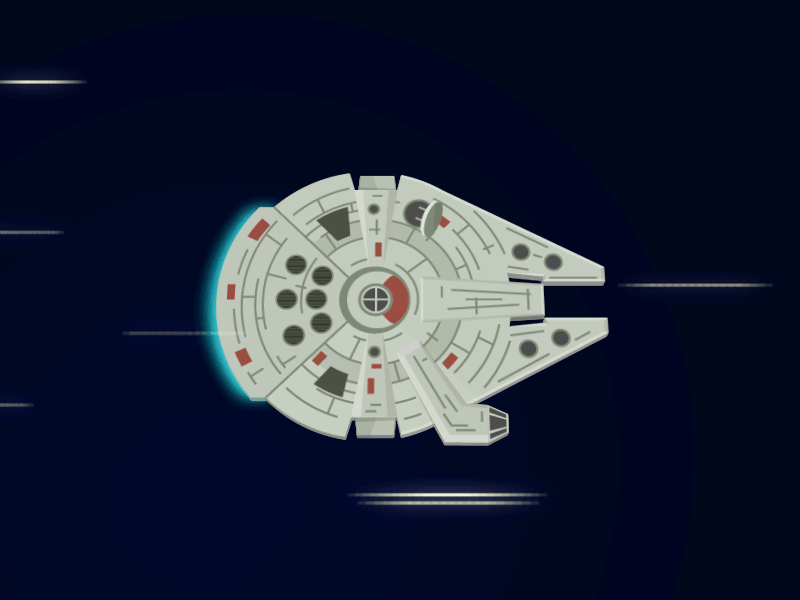

# Portfolio

My Portfolio, a class project

## Projekt Beskrivelse

Man skal selv lave en portfolie, hvor man indrager de nye lærte skills om HTML
og CSS.

### Mine filer

Jeg har en HTML, CSS og JS fil, en markdown fil, plus en folder for mine billeder.

```text
img
index.html
index.js
style.css
```

### HTML

`<!DOCTYPE html>` for at specificere at det er en html-fil til browseren.
`<meta charset="UTF-8">` for at specificere hvad nogle typer karaktere/bogstaver man bruger.  
Så skal mine andrer filer linkes til HTML-filen:

```html
<link rel="stylesheet" href="style.css">
<script src="index.js" defer></script>
```

`defer` betyder at JS-filen loader efter resten af siden har loadet, det er en forsikring så alt
fungerer korrekt.  

Hel min HTML er indenfor den `<section class="tab">` element, mens det hele foregår i `<div class="tab-container">` elementet. Tænk på det som en store boks der indeholder alle elementerne.

Først har vi:

```html
<ul class="tab-nav">
    <li class="active">Home</li>
    <li>HTML</li>
    <li>CSS</li>
    <li>JavaScript</li>
</ul>
```

Jeg bruger en "unordered list" element med class-navn "tab-nav", for at kunde nemt genskue den. Det er den liste der repræsentere min "navigation bar" på toppen af mit hjemmeside. Så har jeg sættet en `class="active"`
til den første list element for at kunne bestemme hvad for en man lander på når man først kommer på siden. Det handler jeg med min JS, som kommer længere ned.

Derefter kan man se at koden er indelt i 4 `div class="tab-body"`, 1 for hver list-element fra før. Den første har "active" ud over, for samme grund som nævnt før.

Hver `div class="tab-body"` er så delt i 2, med `<div class="tab-col-left">` og `<div class="tab-col-right">`,
("col" står for "column") som jeg bruger til at dele siden i 2 lodret i midten. Her er koden for venstre siden:

```html
<div class="tab-col-left">
    
</div>
```

Jeg har valgt at bruge venstre siden for et billede. For at indsætte et billede bruger man et `` tag.
Prikket i starten af linket til mit billede henviser til den folder man befinder sig nu; hvis det var to
prikker, vil det henvise til det parent-folder af projektet. Så her siger jeg at den skal søge på billedet som
befinder sig i den folder vi er lige nu, så gå ind i "img" folder, og så find billedet med navn
"millenium-falcon.gif". `alt` bruges for at vise noget tekst i stedet for billedet hvis den ikke kan findes af
browseren. `width` er en style-element for at vælge størrelsen af billedet i pixels. Det gør jeg for hver billede jeg indsætter.

Så har vi højre siden, som følger denne mønster:

```html
<div class="tab-col-right">
    <h2></h2>
    <p></p>
    <a href="link" target="_blank" class="btn"></a>
</div>
```

Højre siden har så en header med `<h2>`, en afsnit med `<p>` og et link med `<a>` som jeg styler til at være en
knap. `target="_blank"` gør at det åbner en ny fane i browseren når man trykker på linket.
Nogle elementer der bliver brugt i `<p></p>`:
`<strong></strong>`, som gør teksten fed;
`&lt;`, som laver tegnet "<";
`&gt;`, som laver tegnet ">".

Knappen er lidt anderledes for den første side, da jeg havde en idé for en knap, som jeg vil gå mere i detalje med senere.

Den process bliver gentaget flere gange, som gør op hele hjemmesiden.

### CSS

Jeg bruger en color-pallet der har en lille moderne udsyn, med shades af grå og blå, som passer meget godt med billederne jeg har valgt at bruge.

For min navigation-bar på toppen, den har jeg stylet til at være en store boks med de forskellig `<li>` elementer. Linjen under hver knap har jeg gjort ved at bruge `border-bottom`. Så bruger jeg `li.active` til at style den knap som er active, altså den man har trykket på; de skifter farve og bliver større ved bruge af `transform: scale()`.

Jeg har brugt `@keyframes` for at lave min egen animation. Her er det en animation for når man skifter fra en side til en anden. Siden flytter ind i skærmen fra højre med `position: translateX(-20px)`, som gøre at elementet bevæger sig på x-aksen af 20 pixels; også dukker den op ved brug af `opacity`, hvor den går fra usynlig til synlig.

Så for min knap på første siden, "Home", er det lidt det samme princip som animationen fra side til side. Jeg flytter og gøre usynlig det ene dele af boksen, mens den anden gøres synlig, ved brug af `:hover` selectoren. Det er en speciel CSS selector man kan brug for når man vil et element til at reagere til noget når musen bevæger sig på elementet.

### JavaScript

JavaScript er hvor "the magic happens". Det er koden der gør det muligt til at flyt fra en side til den anden i min Portfolie. Det den gør er, at den checker for hvad for en `<li>`-element holder det `'active'` attribute. Så er der en funktion der lytter for en "click" på `<li>`-elementerne, altså hvornår man klikker på min navigation-bar, og så giver det `'active'` attribute til den der blev klikket på.

## AstroPi Forløb

### Vores Projektbeskrivelse

Our idea for the Astro Pi 2022 experiment is to measure the average velocity of an astronaut in the ISS. We are curious to see how fast the astronauts and objects averagely moves from one spot to another in the station.
